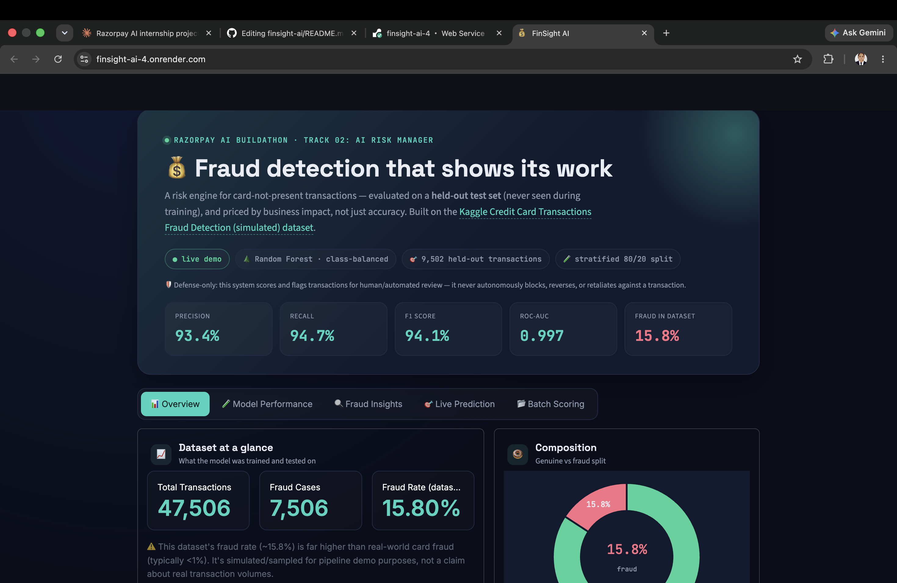
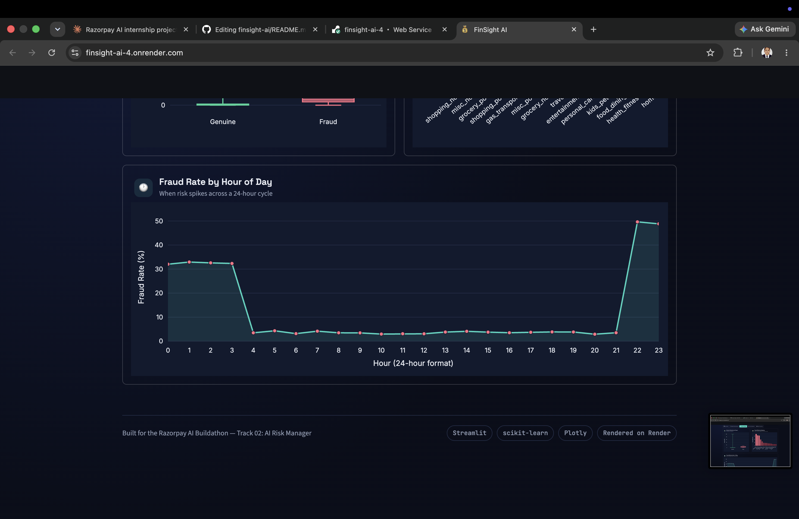
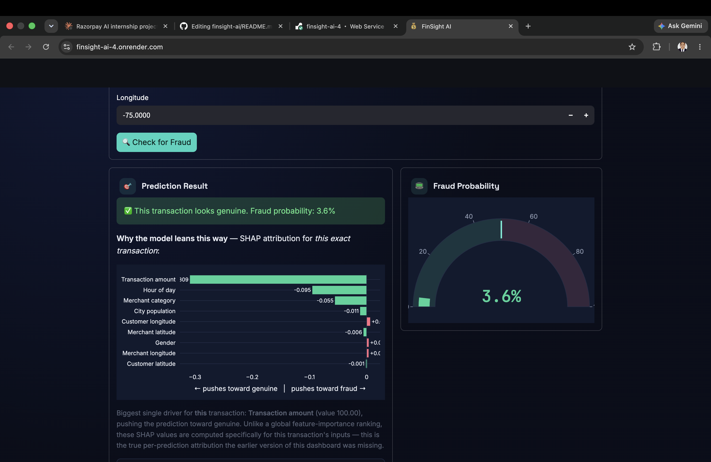

# FinSight AI — Fraud Detection Dashboard

Built for the **Razorpay AI Buildathon — Track 02: AI Risk Manager**.

A working fraud detector for card-not-present transactions: trains a
classifier, reports honest precision/recall/F1 on a held-out test set,
estimates the cost trade-off between false positives and false negatives,
and lets you test individual transactions live — with an LLM-generated
plain-English explanation of every decision.

**Live demo:** https://finsight-ai-te68.onrender.com/

**Defense-only:** this system only scores and flags transactions for
human/automated review. It never autonomously blocks, reverses, or
retaliates against a transaction.

## Screenshots

<!--
  Add 3-4 screenshots here before submitting — this is the first thing
  judges see, and it's the highest-impact thing you can add to this README.

  How to add them:
  1. Take screenshots of: (a) the hero/overview, (b) Live Prediction with
     the SHAP chart, (c) the LLM "explain in plain English" result,
     (d) Batch Scoring results.
  2. Save them in a new `screenshots/` folder in the repo, e.g.
     screenshots/overview.png, screenshots/live-prediction.png
  3. Replace the placeholder lines below with:
     
     
     
  4. Optional but even better: record a 10-15s screen capture and convert
     it to a GIF (e.g. via ezgif.com) instead of a static image for the
     Live Prediction one — GIFs get noticed more in a repo README.
-->

*Screenshots coming — see the [live demo](https://finsight-ai-te68.onrender.com/) in the meantime.*

## What it does

- Classifies a transaction as genuine or fraudulent using a Random Forest
  trained on transaction amount, category, gender, hour of day, and location
  features.
- Reports model performance on data the model never saw during training —
  not just accuracy on the training set.
- Breaks down the cost of getting it wrong in each direction (blocking a
  genuine customer vs. missing real fraud).
- Shows the model's global feature importances so the "why" isn't a black box.
- **Slice checks**: re-checks precision/recall on two harder subsets of the
  test set (high-amount transactions, night-hour transactions) instead of
  trusting a single aggregate number.
- Interactive form to test arbitrary transactions and see the fraud
  probability, with a **true per-transaction SHAP explanation** (not just a
  global ranking) showing which features pushed *this* prediction toward
  fraud or genuine.
- **LLM explanation layer**: an optional "Ask AI to explain this in plain
  English" button that turns the top SHAP drivers into a short,
  analyst-readable explanation (via Groq's free API). This is a
  communication layer only — it narrates the SHAP values that already
  drove the decision, it never influences the model's actual output.
- **Audit trail**: every prediction (live or batch) is logged with a
  timestamp, inputs, probability, and decision, so decisions are traceable.
- **Batch scoring**: upload a CSV of transactions and score all of them at
  once, with a risk-distribution chart and a downloadable results file.
  Rows with a category/gender the model wasn't trained on are safely
  skipped and flagged, not silently mishandled.
- ROC and Precision-Recall curves (threshold-independent view of the model,
  alongside the interactive threshold tuner).
- Clear loading states and empty-state guidance throughout, so the UI never
  looks frozen or blank without explanation.

## Model performance (held-out test set, 20% split, stratified)

| Metric | Value |
|---|---|
| Precision | 93.4% |
| Recall | 94.7% |
| F1 Score | 94.1% |
| ROC-AUC | 0.997 |

Confusion matrix (9,502 held-out transactions):

|  | Predicted Genuine | Predicted Fraud |
|---|---|---|
| **Actual Genuine** | 7,901 | 100 |
| **Actual Fraud** | 79 | 1,422 |

### Slice checks — not just one aggregate number

| Slice | n | Precision | Recall |
|---|---|---|---|
| High-amount transactions (>75th percentile) | 2,376 | 96.1% | 99.3% |
| Night-hour transactions (12am–6am) | 2,097 | 97.4% | 97.9% |

Regenerate all of these numbers yourself with `python train_model.py` — the
script prints the full classification report and writes `metrics.json`,
which the dashboard reads directly (no hardcoded numbers in the app).

## Dataset

Uses a sample of the [Kaggle "Credit Card Transactions Fraud Detection"
(simulated) dataset](https://www.kaggle.com/datasets/kartik2112/fraud-detection) —
47,506 transactions, 7,506 labeled fraud (15.8%).

**Honesty note:** this fraud rate is much higher than real-world card fraud
(typically <1%), because the dataset is simulated/sampled for class balance.
Treat this as a pipeline demo on realistic-shaped data, not a real-world
fraud rate claim.

## Known limitations

- No transaction-velocity features (e.g. "N transactions in the last hour")
  — one of the strongest real fraud signals, not present in this dataset.
- `lat`/`long` are static per customer, not per-transaction GPS, so their
  importance may be inflated relative to a real deployment.
- Batch retraining only — not wired up for streaming/online updates.
- Slice checks cover two subsets (high-amount, night-hour) as a lightweight
  stress test — this is not full adversarial or drift testing.
- The audit trail writes to a local CSV, which is fine for a demo but not
  durable on platforms with an ephemeral filesystem (e.g. Render's free
  tier resets it on redeploy) — a production version would write to a
  database.
- The LLM explanation is a plain-English narration of the SHAP values, not
  an independent check — it can only be as accurate as the SHAP attribution
  it's summarizing.

## Tech stack

- **Model:** scikit-learn `RandomForestClassifier` (class-balanced)
- **Explainability:** SHAP `TreeExplainer` for per-transaction attribution
- **LLM explanation layer:** Groq API (`openai/gpt-oss-120b`)
- **App:** Streamlit
- **Deployment:** Render

## Running locally

```bash
pip install -r requirements.txt

# (Re)train the model and generate metrics.json
cd data-and-training  # wherever transactions_sample.csv + train_model.py live
python train_model.py

# Set up the LLM explanation layer (optional — the app works without it,
# it just shows a message if the key isn't set)
echo "GROQ_API_KEY=your_key_here" > .env
# get a free key at console.groq.com — no credit card required

# Run the dashboard
streamlit run app.py
```

## Project structure

```
├── app.py                  # Streamlit dashboard
├── train_model.py          # Training script — outputs model + metrics.json
├── test_llm.py             # Standalone script to verify the Groq API key/setup
├── .env                    # GROQ_API_KEY (not committed — see .gitignore)
├── data/
│   └── transactions_sample.csv
├── models/
│   ├── fraud_model.pkl
│   ├── le_category.pkl
│   ├── le_gender.pkl
│   └── metrics.json
├── logs/
│   └── audit_trail.csv     # Generated at runtime, one row per prediction
├── requirements.txt
└── runtime.txt
```
